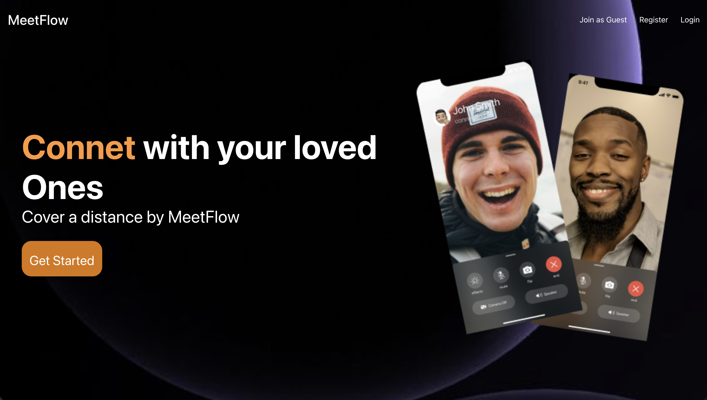
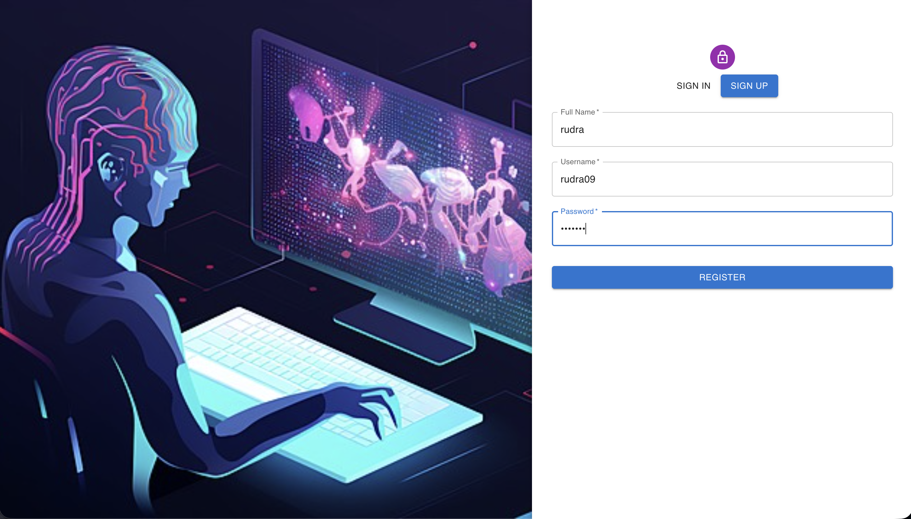
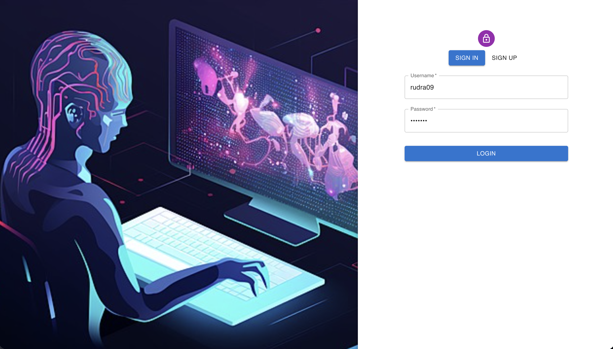
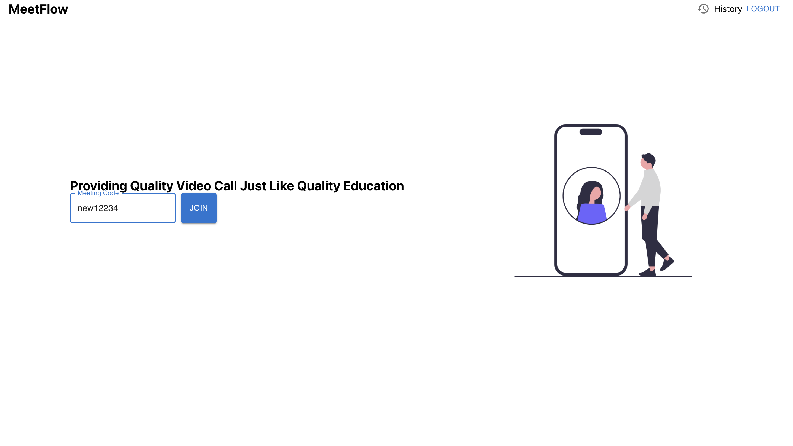
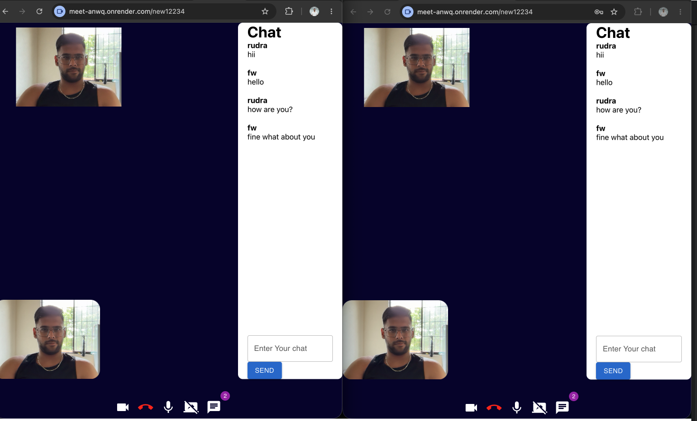

# 🎥 MeetFlow

MeetFlow is a full-stack video conferencing application that enables users to create and join meetings using a unique meeting code. It supports real-time video and audio communication, screen sharing, and live chat using **WebRTC** and **Socket.IO**.

Live Demo - https://meet-anwq.onrender.com/

## 🚀 Features

- 📹 Real-time video conferencing
- 🎙️ Audio communication
- 🖥️ Screen sharing
- 💬 Real-time chat
- 🔗 Join meetings using a unique meeting code
- 👥 Multi-user video conferencing
- 🎥 Camera On/Off
- 🎤 Microphone Mute/Unmute
- ⚡ WebRTC peer-to-peer communication
- 🌐 Socket.IO signaling server

---

## 🛠️ Tech Stack

### Frontend

- React.js
- React Router
- Material UI
- Axios
- WebRTC
- Socket.IO Client

### Backend

- Node.js
- Express.js
- Socket.IO
- MongoDB
- Mongoose

---

## 📁 Project Structure

```text
MEETFLOW/
│
├── backend/
│   ├── src/
│   │   ├── controllers/
│   │   ├── middlewares/
│   │   ├── models/
│   │   ├── routes/
│   │   └── app.js
│   ├── package.json
│   └── package-lock.json
│
├── frontend/
│   ├── public/
│   ├── src/
│   │   ├── contexts/
│   │   ├── pages/
│   │   ├── styles/
│   │   ├── utils/
│   │   ├── App.js
│   │   ├── index.js
│   │   └── index.css
│   ├── package.json
│   └── package-lock.json
│
└── README.md
```

---

## ⚙️ Installation

### Clone the Repository

```bash
https://github.com/rudraydv09/MeetFlow---Video-Conferencing.git
cd MeetFlow
```

### Install Backend Dependencies

```bash
cd backend
npm install
```

### Install Frontend Dependencies

```bash
cd ../frontend
npm install
```

---

## ▶️ Running the Project

### Start Backend

```bash
cd backend
npm start
```

### Start Frontend

```bash
cd frontend
npm start
```
---

## 🌍 Deployment

| Service | Platform |
|---------|----------|
| Frontend | Render Static Site |
| Backend | Render Web Service |
| Database | MongoDB Atlas |

---

## 📸 Screenshots

<p align="center">
  
</p>

<p align="center">
  
  
</p>

<p align="center">
  
  
</p>


---

## 🔄 Application Workflow

1. Open MeetFlow.
2. Create or enter a meeting code.
3. Share the meeting code with participants.
4. Join the meeting.
5. Communicate using video and audio.
6. Chat with other participants.
7. Share your screen when presenting.

---

## 🚀 Future Enhancements

- Meeting recording
- Waiting room
- Authentication
- Participant management
- File sharing
- Virtual backgrounds
- Raise hand feature
- Meeting scheduling

---

## 👨‍💻 Author

Rudra Pratap Singh Yadav

- GitHub: https://github.com/rudraydv09
- LinkedIn: https://linkedin.com/in/rudra0912

---

## ⭐ Support

If you found this project helpful, please consider giving it a ⭐ on GitHub.
